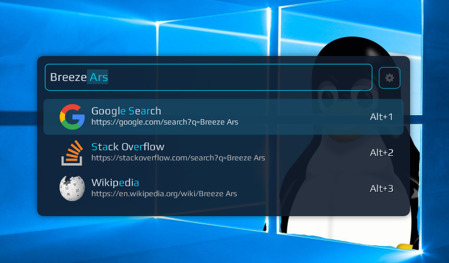

# Breeze Ars theme for Ulauncher
Based on a few themes, I created a theme that matches the qt-breeze-ars color scheme, some incompatibilities may occur, sorry, you can change the css file optionally.




## Installation
Run the following script in your terminal:
```shell
mkdir -p ~/.config/ulauncher/user-themes

git clone https://github.com/MagaCyan/breeze-ars.git ~/.config/ulauncher/user-themes/breeze-ars
```
